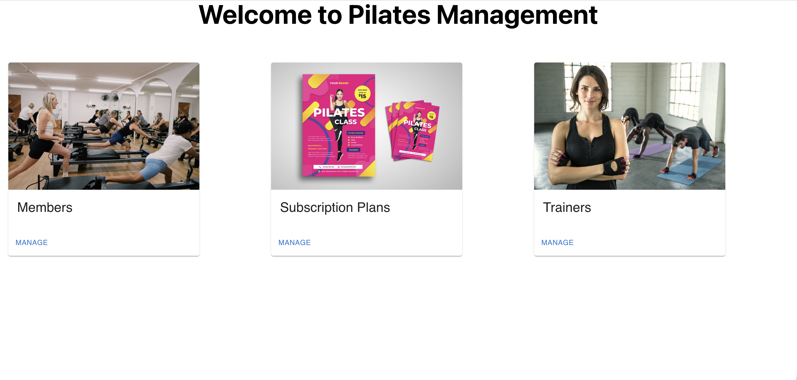
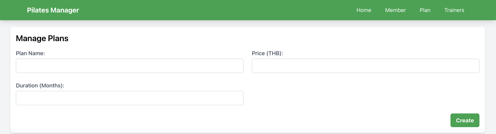
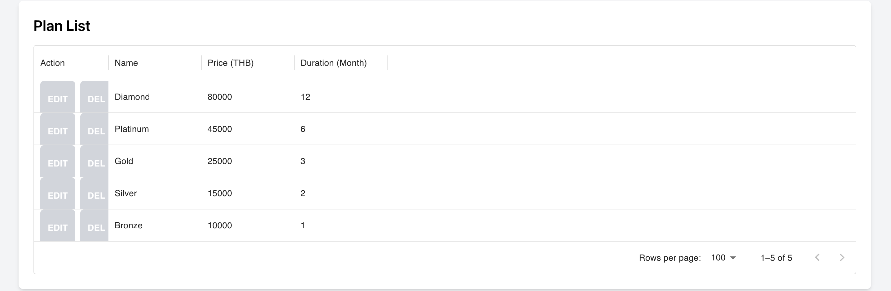
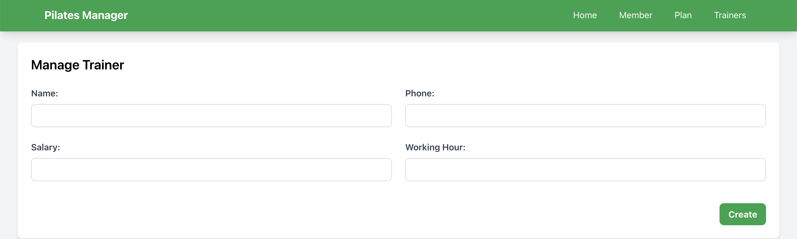
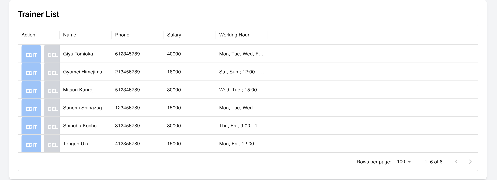
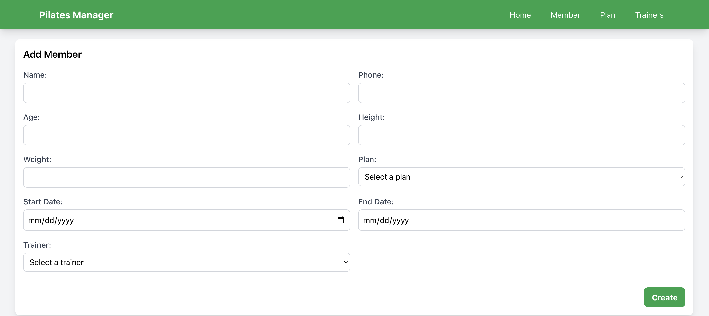
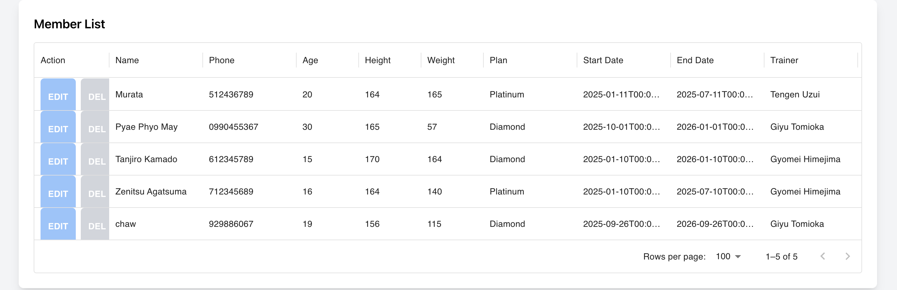

# Project Name: Pilates Manager
https://wad-6622088-final.westus.cloudapp.azure.com/

# Team Members
Myo Thant Naing - 6622088 - Section 542
Chaw Yadanar Oo - 6632782 - Section 542

# Description
For this final project, we built Pilates Manager using Next.js and tailwind with three data models; members, suscription models and trainers.

# Home Page
In the home page, the system manager can manage three categories members, suscription plans and trainers.

# Subscription Plan Page
In the subscription plan page, there are three input fields; Plan Name, Price in THB and Duratin (Months). All added plans will be shown under there. The manager can edit and delete the existing plans. 

# Trainer Page
In the trainer page, there are four input fields; Name, Phone, Salary and Working Hour. All added trainer list will be displayed below the input fileds.The manager can create new trainers or update and delete the existing Trainer List as well. ( We use string type input for Hour field).

# Member Page
In the member page, there are nine input fields; Name, Phone, Age, Weight, Plan, Start Date, End Date( Automatically set) and Trainer.All details of the existing members will also be displayed there. In case of adding a new member, the manager need to choose the plan and trainer.So, he/she need to create the plan and trainer in Suscription Plan and Trainer Pages frist. The end date is automatically set according to the plan he/she chose. For example, Bronze plan last for three months so if the start date is 12/10/2025 the end date will be automatically 01/10/2026. The manager can also delete and update the member list. 

